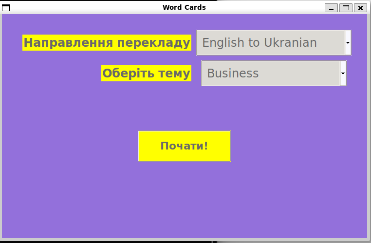
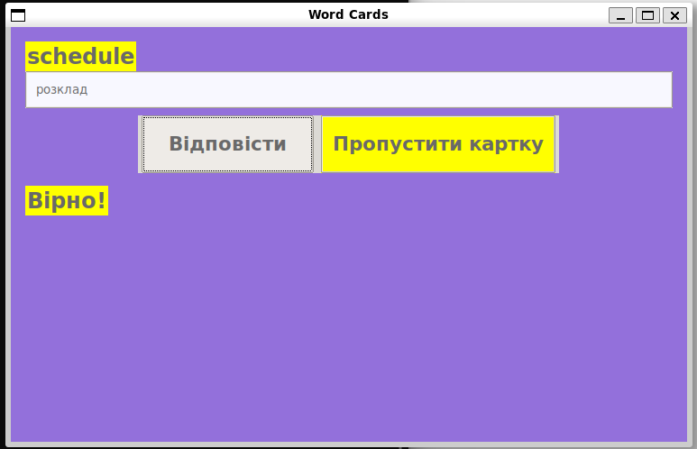
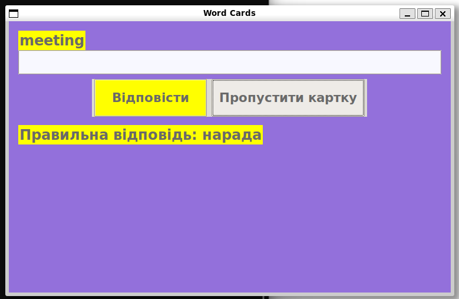
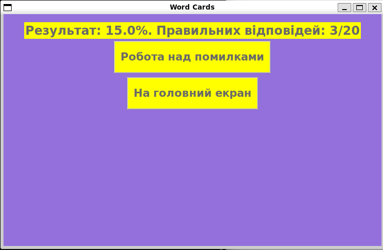
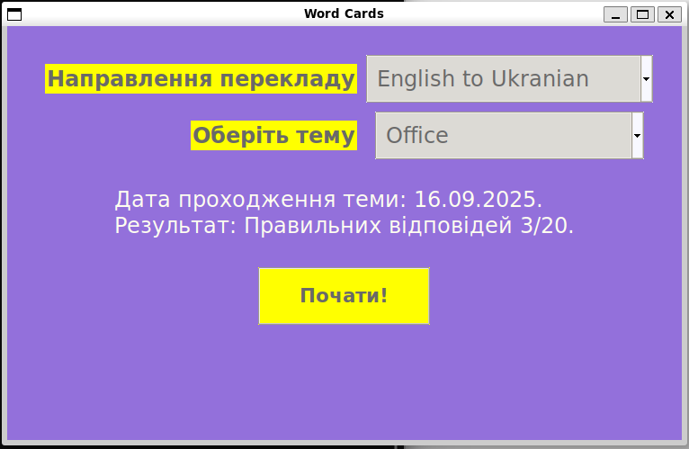

# WordCards

**WordCards** is an application for practicing English words using flashcards.  
The project is written in Python and uses a graphical interface based on Tkinter.

## Main Features

- Two learning directions: from Ukrainian to English and vice versa.
- Topic selection for flashcards (for example: business, IT, work, etc.).
- Tracks statistics for each topic: how many times and when it was completed, and results (number of correct answers).
- Option to repeat cards with mistakes for better retention.
- Add or remove your own topics and words for customization.
- Three main screens: mode/topic selection, training mode, and results screen.

## How the Application Works

1. **Launch:**  
   Open the application (run the file, for example, `ui_cli.py`).

2. **Select direction and topic:**  
   The user selects the translation direction (Ukr → Eng or Eng → Ukr) and the training topic.

3. **Topic statistics:**  
   If the topic has already been practiced, the app displays the date of the last session and the results (number of correct answers out of total).

4. **Training:**  
   - Words appear one at a time on the screen in random order.
   - The user enters the translation and clicks the "Answer" button.
   - If the answer is correct, a "Correct" message appears; if not, "Incorrect, correct answer: ...".
   - You can skip a card if you don't know the answer.

5. **Results screen:**  
   After finishing the round, the results screen shows the percentage of correct answers and two buttons:  
   - "Return to main screen"
   - "Work on mistakes" (repeat only the cards that were answered incorrectly).

## Screenshots

Main menu:  


Training window - "Answer" button:  


Training window - "Skip card" button:  


Results screen:  


Main menu with saved results for a topic:  


## Flashcard Structure

The project includes an example file with cards (200 words):  
- 10 topics from business, IT, and other work fields, 20 words in each.
- You can add your own topics and words or delete existing ones to customize the app.

## Installation and Launch

1. **Clone the repository:**
   ```bash
   git clone https://github.com/TMalik26/WordCards.git
   cd WordCards
   ```

2. **Ensure Python 3 and the `tkinter` library are installed.**

3. **Run the application:**
   ```bash
   python ui_cli.py
   ```